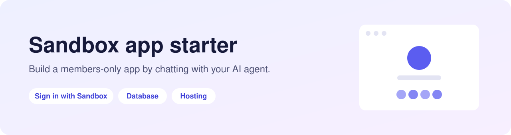
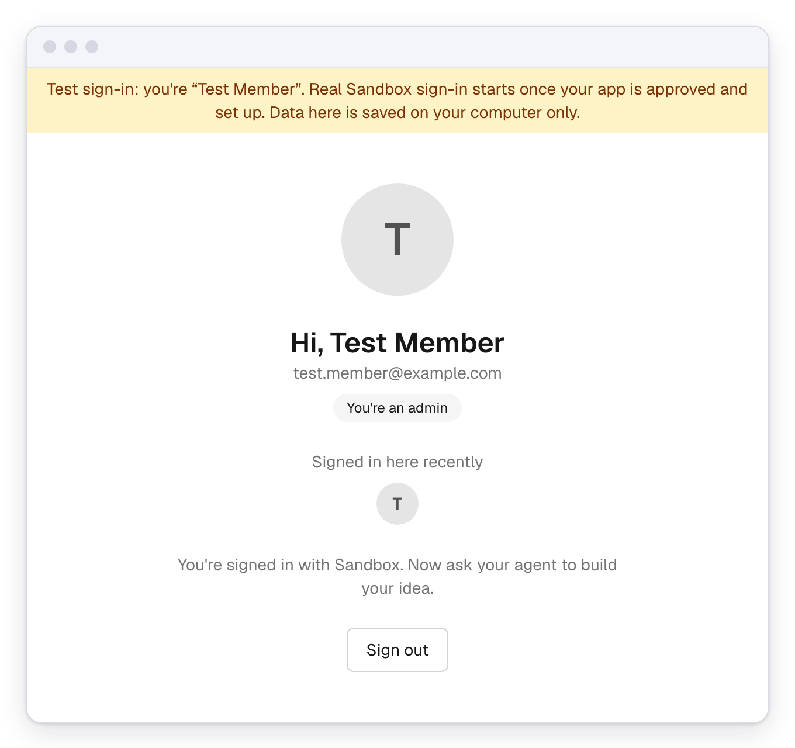
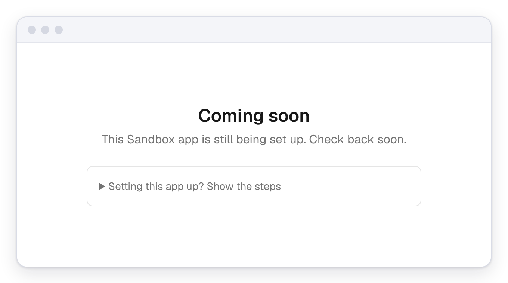

<picture>
  <source media="(prefers-color-scheme: dark)" srcset="docs/banner-dark.svg">
  
</picture>

**You'll need:** Claude Code or Cursor, and free [GitHub](https://github.com/signup)
and [Vercel](https://vercel.com/signup) accounts. Ideally, also ask a Sandbox admin to
add you to the [sandbox-is](https://github.com/sandbox-is) GitHub org, where members'
apps live together.

## 1. Start

Paste this into your agent, changing the name and the idea:

```
Make me a new Sandbox app called hub-dinners. Create it with:

  npx create-next-app@latest hub-dinners --use-npm --yes \
    --example https://github.com/simonwisdom/sandbox-starter

Then read its AGENTS.md and run it.
I want to build: an RSVP page for our hub's dinners.
```

## 2. Build

Keep chatting. While you build, you're signed in as "Test Member" and your data
stays on your computer.



## 3. Go live

| You | What happens |
|---|---|
| Say *"put it online"* | Your agent puts it on GitHub and Vercel with a free database, and gives you its address |
| Link that address on the [Vibes page](https://members.sandbox.is/vibes) (local port `3000`) | An admin reviews it. Until then, visitors see "Coming soon" |
| Once approved, say *"finish Sandbox setup"* and give your app's ID | Real Sandbox sign-in turns on |



After that, every change goes online by itself. Stuck? Ask your agent: the fixes
are in `AGENTS.md`.

> Your app's ID isn't secret, so it's fine to share with your agent. Never paste
> any other setting into a chat.

<details>
<summary><strong>More</strong></summary>

### Work on someone else's app

Ask your agent: *"Help me work on github.com/sandbox-is/hub-dinners."* It runs
the app on your computer with test sign-in, and sends your changes to the owner
as a pull request.

### Prefer clicking?

[](https://vercel.com/new/clone?repository-url=https%3A%2F%2Fgithub.com%2Fsimonwisdom%2Fsandbox-starter&project-name=my-sandbox-app&repository-name=my-sandbox-app)

This copies the template and puts it online in one go. Then open your copy with
your agent and carry on from step 2.

### What's inside

- Next.js and Tailwind, hosted on Vercel
- Sign in with Sandbox, via [sandbox-auth](https://github.com/cesarsalazar/sandbox-auth)
- A Postgres database: local on your computer, [Neon](https://neon.tech) online
- Members who sign in are remembered, and some can be admins
- `AGENTS.md`: instructions and rules for your agent

</details>
